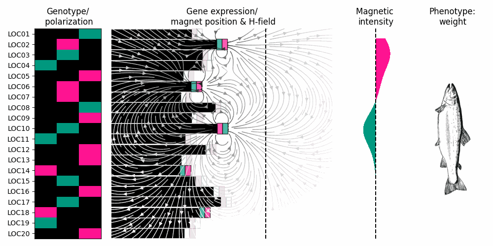

# causal_multi_omics

This project received funding from the European Union’s Horizon 2020 research and innovation programme [952914] (FindingPheno).

## Getting started

Add the all_chromosomes.csv to the data directory

# Install dependencies by executing the following in the terminal commands:

    conda create -n cmor
    conda activate cmor
    conda install python
    conda install pandas
    conda install scikit-learn
    conda install matplotlib
    pip install magpylib

# Create the data directory if this does not exist already

    mkdir data
    
# 1. Find an alpha to use in later LASSO

The first file runs LASSO with different alpha parameters in search of the one with the best Mean Absolute Error (MAE)  
    
    cd code
    python step1_select_best_alpha_for_lasso.py {Path/to/file} {Output index (int)}

# 2. Perform a first round of feature selection using LASSO

This will run a LASSO regression on the features using the alpha found in the previous step. It will output a set of features that at least once did not end up zero-weighted by the end of the LASSO.

    python step2_lasso_feature_selection.py {Path/to/file} {Output index (int)}

# 3. Perform a second round of feature selection based on robustness

This step does repeated holdout sampling i.e. for 10000 iterations, randomly select 10 features. With these 10 features, perform 100 CV splits using Linear Regression to predict the fish weight.

    python step3_robustness_feature_selection {Path/to/file} {Output index (int)}

# 4. Attribute the results of step 3 to individual genes

Out of step 3 we get validation accuracies for linear regression run on 10 features at a time. Here we iterate over those scores and collect an average score associated with each gene. The resulting file from this can then be used to rank genes in terms of robustness.

    python step4_aggregate_MAEs.py {Path/to/file} {Output index (int)}
